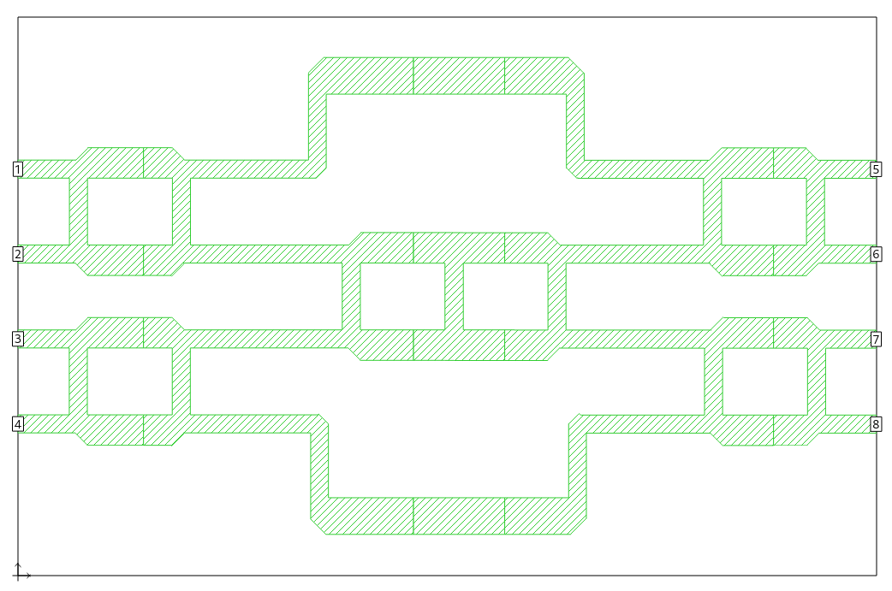
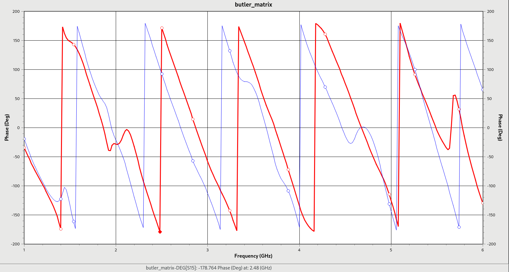

# butler_matrix
A 4 X 4 butler matrix beamforming network used to feed a phased array of antenna elements.

S18 (blue curve) shows some phase deviation from S15 (red curve) 

TODO : 
1. Derive the [equations for microstrip dimensions](./microstrip_dimensions.png) of [hybrid couplers, delay and Crossover blocks](./circuit_blocks.png) 
2. Reduces or even eliminates all box resonance modes of the microstrip layout model

Credit : [Angular Beamforming Technique for MIMO Beamforming System.pdf](https://www.researchgate.net/publication/258386128_Angular_Beamforming_Technique_for_MIMO_Beamforming_System) and EDABoard forum
